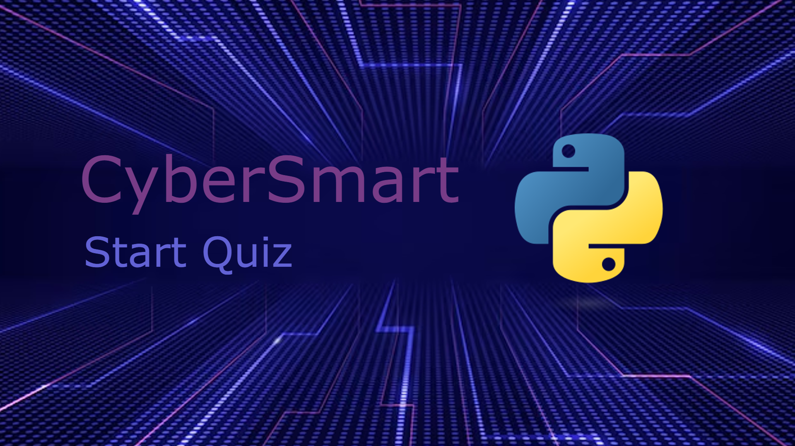

# CyberSmart Start Quiz



## Overview

The **CyberSmart Start Quiz** is an educational command-line interface (CLI) quiz designed to teach kids under 14 about online safety. The quiz tests knowledge on various aspects of cybersecurity, encouraging young users to develop safe online habits.

## Features

- **Difficulty Levels**: Choose from Easy, Medium, or Hard modes.
- **Randomized Questions**: Questions are shuffled in a random order to ensure a fresh experience each time you play this quiz.
- **Score and Progress Tracking**: Track your score, attempts remaining, and progress through the quiz.
- **Polished Interface**: The interface is enhanced with color-coded text for a visually appealing experience.

## How to Play

1. **Enter Your Name and Age**: Provide your name and age to start the quiz. If you are 14 or older, you will be advised to try the CyberSmart Youth Quiz instead.
2. **Select Difficulty**: Choose your difficulty level:
   - 1: Easy (10 questions)
   - 2: Medium (20 questions)
   - 3: Hard (30 questions)
3. **Answer Questions**: Respond to multiple-choice questions by typing the corresponding number (1-4). You have three attempts per question.
   - If you answer correctly on the first try, you'll earn a point.
   - If you fail to answer correctly within three attempts, the correct answer will be revealed, and you can move on to the next question.
4. **End of Quiz**: After completing all questions, you can choose to play again or exit.

## Installation

To run the CyberSmart Start Quiz, you'll need Python installed on your system. Follow these steps to get started:

### Windows

1. Download the latest release of the CyberSmart Start Quiz
2. Unpack the .zip file and open the root directory of the project
3. Run `install.bat` then after installation, run `run.bat`
4. Enjoy!

### Linux

1. Clone this repository:
   ```bash
   git clone https://github.com/Voltage-86/cybersmart-start-quiz.git
   ```
2. Open the root directory of the project
3. Install the dependencies with `pip install -r requirements.txt`
4. Run `python cybersmart.py` or `python3 cybersmart.py`
5. Enjoy!

